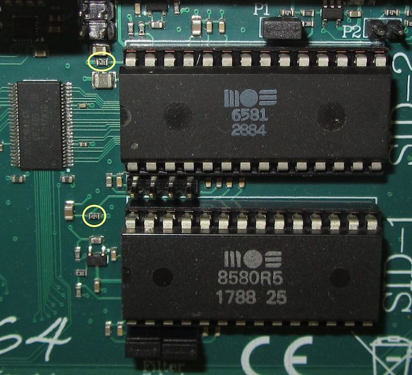
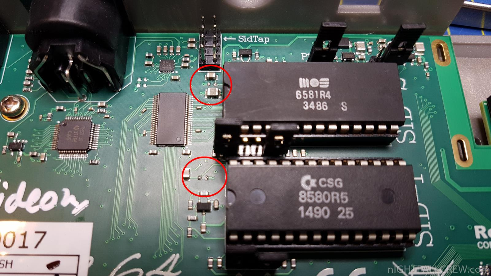

=======================================
**This Document is a Work In Progress**
=======================================

=================
Ultimate 64 (U64)
=================

.. contents:: **CONTENTS**
   :depth: 3

Installing U64 into a C64 or C64c encloser
------------------------------------------
The Ultimate 64 comes without an encloser. this means that you will need to
find one yourself. There are various sources where you can find a C64 or C64c
encloser. Most commenly used sources are probably ebay and other classifieds
websites. If you have an old C64 which is out or order, you can use that case
also.

Another source is `Pixelwizard Retros shop
<https://shop.pixelwizard.eu/commodore-c64/>`_ These are newly moulded C64c
cases from an old mould that was found in some warehouse a few years ago.

The easiest is to install the U64 into a C64 bread bin enlosure. For the most
C64c enclosures you will need to use some creativity ;-)

C64 bread box
^^^^^^^^^^^^^

"[...] If the connector plate is not included or missing, you can find 3d
print-files for 3d printing the connector plate here:
https://www.thingiverse.com/thing:959633. There are various 3d printing
services available in over 160 countries if you don't have a 3d printer. [...]"

The easiest is to obtain an empty C64 breadbin case. But, make sure that the
side plate is included. This plate will cover up the carve-out on the right
side and will only expose the power port, on/off button and the control ports.
So, make sure these are also delivered when you buy an empty case.

If the connector plate is not included, make sure to tell the seller and have
it sell it to you for less. When this the case you can find 3d print-files of
this connector plate here: `https://www.thingiverse.com/thing:959633
<https://www.thingiverse.com/thing:959 633>`_. There are various 3d printing
services available in over 160 countries if you don't have a 3d printer.

If you're into 3d printing yourself and able to change designs, you could try
matching the power port and the on/off button holes to match the U64 buttons
and power port. Please make sure to publish these modified files so others can
also make use of it.

C64c enclosure
^^^^^^^^^^^^^^
If you don't already have a C64c case you can re-use, there are several ways to
obtain a C64c enclosure:

1. Buy an empty case from e-bay or any other classifieds website
2. Buy a newly produced empty case from `the Pixel Wizard Shop <https://shop.pixelwizard.eu/>`_.
3. Buy a complete C64c.

Almost all C64c cases need a keyboard mount to install the keyboard. There are
several remakes of these keyboard mounts, but they're either a fit for a real
C64 or a `commodore c64 reloaded <https://icomp.de/>`_ by `Individual Computers
<https://icomp.de/shop-icomp/en/shop/product/c64-reloaded-mk2.html>`_. `Carl
Levik <https://www.facebook.com/crashmeplease>`_ created a 3d-print design of
these brackes specifically for use with the Ultimate64. You can find the files
on `Thingverse <https://www.thingiverse.com/thing:3051450>`_. The posting
announcing this design on the Facebook group can be found `here
<https://www.facebook.com/groups/1541ultimate/permalink/10155924605747753/>`_.

Video output
------------
The U64 supports 4 types of video signals:

1. HDMI
2. S-video
3. CVBS (composite)
4. RGB (analog)

HDMI
^^^^
The Ultimate 64 supports HDMI-output. Due to the fact that it doubles the
amount of lines, to create the 576p screen resolution output, it is possible to
fade alternate lines so simulate scan lines. You can turn these 'scan lines'
on/of in the Ultimate 64 settings menu.

Use a standard HDMI cable to connect your U64 to your LCD monitor or TV.

What about DVI? Why doesn't my HDMI->DVI adapter work?
^^^^^^^^^^^^^^^^^^^^^^^^^^^^^^^^^^^^^^^^^^^^^^^^^^^^^^
The HDMI signal cannot (yet) be used on a HDMI-to-DVI converter. In a future
version of the u64 software it will be possible to choose which type of HDMI
signal the U64 should create. One is for HDMI devices and the other will be for
DVI devices.

S-video & CVBS (composite)
^^^^^^^^^^^^^^^^^^^^^^^^^^
Like the real C64, the U64 supports S-video and CVBS signal output on the A/V
port. This means you can use the same cables for the U64 as you use for you C64.

The connector pin layout can be found in `the manual. </hardware/av_plug.html>`_

RGB (analog)
^^^^^^^^^^^^
New for the commodore 64 users is that the U64 supports the `RGB (analog)
<https://en.wikipedia.org/wiki/Component_video#RGB_analog_component_vid eo>`_
video signal.

The A/V port can be configured to output this signal. The signal will be
available on the following pins of the A/V port as explained in `the manual
</hardware/av_plug.html>`_.

Audio output
------------
**Jeff Robertson**:
This reminds me. There is no mini phono jack on the U64. Emulated audio will be
passed over HDMI and audio from the SID(s) will output from the A/V port,
correct? It is fortunate that in have an HDMI monitor. It has an analog phono
out but I have never tested it. I think it has some weird requirement for power
from the USB in port. As a fallback plan, I think I might be able to make use
of my SCART to HDMI converter box. It has an analog out.

**Gideon:**
The audio output from the A/V DIN is *the same* as the audio output through
HDMI. Same digital stream that goes to both outputs.

Emulated SID
^^^^^^^^^^^^
.. Warning::
Is er verschil tussen emusid 1 en emusid 2? Is er uberhaupt onderscheid voor de
6581 en de 8580 sid chip in de sid emulatie?

**Let op:** Er is weinig tot geen verschil te horen tussen beide SID modellen.
De karakteristiek van de 8580 wordt niet goed weergegeven.

Installing SID chips
^^^^^^^^^^^^^^^^^^^^
The U64 comes with 2 SID-sockets to allow the real SID-lovers to install one or
two real sid chips. Other SID devices like SIDFX, Swinsid and FPGASID can also
be installed. They act like real SID chips, so there's no reason these won't
work also.

To install a SID make sure you put them in with the little

> All three jumpers on for 8580, all jumpers off for 6581 -- Gideon

.. table:: **Voltage settings**
   :widths: auto
   :align: left

====== =============
Jumper Sid Socket   
====== =============
P1     Sid-1 Voltage
P2     Sid-2 Voltage
====== =============

.. table:: **Voltage settings 2**
   :widths: auto
   :align: left

=========  ==========
Jumper     Voltage
=========  ==========
Closed/on  9V (8580)
Open/off   12V (6581)
=========  ==========

.. table:: **Filter Select:**
   :widths: auto
   :align: left

=========   =========
jumper      SID model
=========   =========
Closed/On   8580
Open/Off    6581
=========   =========

What are the SidTap pin headers for?
^^^^^^^^^^^^^^^^^^^^^^^^^^^^^^^^^^^^
The SIDtap headers/pins are pin headers that can be used to connect the audio
from the SID chips directly to your amplifier using either some RCA plugs or a
(mini) jack plug.

You can find an explanation of these pins here `SidTap connector pinout
</hardware/sid_tap.html>`_.

DigiFix resistors on the V1.1 board
^^^^^^^^^^^^^^^^^^^^^^^^^^^^^^^^^^^
A small discussion about DigiFix on the v1.1 board

**Grue on discovered the following:**
Ultimate 64 and "digi fix". I noticed that my 6581r4 didn't play samples so I
did bend ext-in pin so that it doesn't touch socket and digi playback came
back. So I think there is some kind of digi fix resistor in play. Is this
connected to both sockets or can it be disabled in software in some point of
future?

**Gideon commented:**
There is a fixed resistor to ground on the ext-in, in the range that was
suitable for 8580 to play samples. I did not know this would actually *disable*
samples for the 6581? (Wtf?). Not fixable in software, unless I "superimpose"
sample playback onto the SID signal, thus emulating only this part of the SID,
in external SID mode. I am about to release 1.2 for production. This is
something that needs to be changed, then?

**Grue:** Yes it is, also new tricks on 8580 wont work if there is resistor
connected. I think it would be better without resistors at all

**Gideon:**
I will remove the resistor from the bill of materials for the next run.

**Joerg Droege**
Gideon Zweijtzer so can we have a photo which resistor to remove for guy like
me who still have it on their boards, please? :)

**Gideon:**
DigiFix resistors on the V1.1 board (are circled in the picture below):

After removal of the resistors the board looks like this:

Playing 2SID and 3SID tunes
^^^^^^^^^^^^^^^^^^^^^^^^^^^

Most 2SID and 3SID tunes are composed for the 8580 SID. There are only a few
that are composed for the 6581 SID. Up until now I have not yet seen 2SID tunes
that are composed for the combination of a 6581/8580 or 8580/6581.

2SID tunes send SID data to both SIDs at once. The first SID will receive its
data at i/o address $D400. The second SID will receive its data at another i/o
address. Most used combinations are for SID1/SID2: $D400/$D420, $D400/$D500,
$D400/$DE00. Others are possible.

How to configure the U64 for 2SID tunes
^^^^^^^^^^^^^^^^^^^^^^^^^^^^^^^^^^^^^^^
1. Go to the Ultimate menu bij pressing the on/off switch shortly.
2. Press F2 (shift + F1) to enter the configuration m2nu
3. Now select the "U64 Specific Settings" and press return
4. Make sure that "SID Socket 1 Address" is set to $D400
5. Now set the "SID Socket 2 Address" to the second SID address.
6. Press RUN/STOP to get back to the Ultimate menu.

Choose the SID tune you'd like to play or try running `Antipop
<http://csdb.dk/release/?id=161753>`_ which is a 2SID music album. Make sure
that you have set "Sid Socket 2 Address" to e.g. $D420 when running `Antipop
<http://csdb.dk/release/?id=161753>`_.

How to configure the U64 for 3SID tunes
^^^^^^^^^^^^^^^^^^^^^^^^^^^^^^^^^^^^^^^
1. Go to the Ultimate menu bij pressing the on/off switch shortly.
2. Press F2 (shift + F1) to enter the configuration menu
3. Now select the "U64 Specific Settings" and press return
4. Make sure that "SID Socket 1 Address" is set to $D400
5. Now set the "SID Socket 2 Address" to the second SID address.
6. Now set the "UltiSID 1 Address" to the third SID address.
6. Press RUN/STOP to get back to the Ultimate menu.
7. Now run the 3SID tune using the built-in Ultimate SID Player.

How to find out which address the second and third SID uses
^^^^^^^^^^^^^^^^^^^^^^^^^^^^^^^^^^^^^^^^^^^^^^^^^^^^^^^^^^^
This is a valid question. Since there is no 'standard', composers can choose
any SID address that is available.

An easy way to find out which addresses the extra SIDs are using, is run the
SID files using the built-in Ultimate SID Player. SID Player will show you the
addresses of the SIDs used by the SID, 2SID and 3SID files.

PIN headers found on the U64 PCB
--------------------------------

What are the SIDtap headers for?
^^^^^^^^^^^^^^^^^^^^^^^^^^^^^^^^
The SIDtap headers/pins are pins that can be used to connect the audio from the
SID chips directly to your amplifier using either RCA plugs or a (mini) jack
plug.

More information about the `SidTap pin headers </hardware/sid_tap.html>`_.

What are the SPKDAT pin headers for?
------------------------------------
**Gideon:**
SPKDAT is currently not in use. The outermost pins are GND and 3.3V, the inner
pins are data pins; designed to be: speaker enable and speaker data (PDM
signal). Depending on the amplifier chosen, this may change. Not enabled yet in
initial firmware release..

Easyflash
^^^^^^^^^
**Gideon** (`Link to facebook posting
<https://www.facebook.com/groups/1541ultimate/permalink/10155613797127753/?comme
nt_id=10155613879042753&reply_comment_id=10155617090162753&comment_tracking=%7B%
22tn%22%3A%22R%22%7D>`_)

Jarkko Lehti: EasyFlash works, except for the kernal replacement mode. I
understand why, so it is _probably_ fixable. I am doing some rework on the
preliminary cartridge code in the FPGA. It has become a bit complicated, due to
the built-in U2+, which also uses the same bus. It needs refactoring.

Can I use the U64 as a U2+ for another C64?
^^^^^^^^^^^^^^^^^^^^^^^^^^^^^^^^^^^^^^^^^^^
**Gideon** (`Link to facebook posting
<https://www.facebook.com/groups/1541ultimate/permalink/1015564172625275
3/?comment_id=10155642475427753&comment_tracking=%7B%22tn%22%3A%22R%22%7D>`_ )

Yes... This is possible. However, you'll need to take the "C64" part off from
the IEC bus. You can do this by issuing some "pokes" to set CLOCK and DATA
lines high.

|Gideon? Welke "pokes" zijn hiervoor nodig? Of ga je hier een 'enable/disable'
optie van maken in de Ultimate configuratie menu?

Firmware releases
-----------------
V1.02
^^^^^
**Download**

* `update_v1.02.zip <http://1541ultimate.net/content/download/update_v1.02.zip>`_ (1541ultimate.net)
* SHA-256: ceaf9a711a7f8fee4d2a9d0d112050db73df4573ac814ca880fae94ade45943d

**Release Notes**

Fixes compared to initial release:

* Sprite Collisions
* Illegal graphics fetches
* Sprite DMA timing
* Nuvie Player
* NMI handling improved in 6502
* Illegal reads when BA=0 masked out ("PLA" issue)
* Added debounce on Restore Key
* KCS power cart fixed (sprite graphics error)

.. note:: HDMI output now outputs DVI by default (no audio). You can turn on HDMI in the configuration menu. In the next firmware this will be automatic by analysing the EDID data from the monitor.
